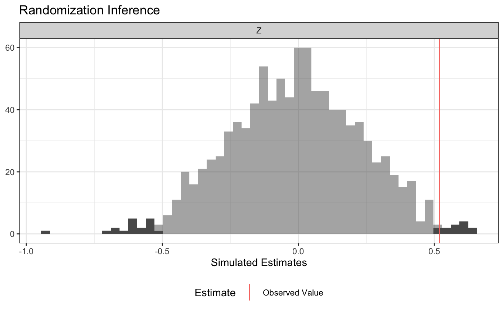

<!-- README.md is generated from README.Rmd. Please edit that file -->

ri2 makes conducting randomization inference easy and (with the blessing
of the original authors) is the successor package to
[ri](https://cran.r-project.org/web/packages/ri/index.html).

ri2 has specific support for the following:

1.  All randomization schemes in
    [randomizr](http://randomizr.declaredesign.org).
2.  Difference-in-means and OLS-adjusted estimates of ATE estimates
    using R-native formula syntax.
3.  Multi-arm trials.
4.  ANOVA-style hypothesis tests (e.g., testing interaction term under
    null of constant effects),

Additionally, ri2 provides:

1.  Accommodation for arbitrary randomization schemes
2.  Accommodation for arbitrary (scalar) test statistics

You can install ri2 is on CRAN

``` r
install.packages("ri2")
```

If you’d like to install the most current development release, you can
use the following code:

``` r
install.packages("devtools")
devtools::install_github("acoppock/ri2")
```

Here is the basic syntax for a two-arm trial:

``` r
library(ri2)
#> Loading required package: randomizr
#> Loading required package: estimatr
N <- 100
declaration <- declare_ra(N = N, m = 50)

Z <- conduct_ra(declaration)
X <- rnorm(N)
Y <- .9 * X + .2 * Z + rnorm(N)
dat <- data.frame(Y, X, Z)

ri_out <-
  conduct_ri(
    formula = Y ~ Z,
    declaration = declaration,
    assignment = "Z",
    sharp_hypothesis = 0,
    data = dat
  )

plot(ri_out)
```

<!-- -->

``` r
summary(ri_out)
#>   coefficient  estimate two_tailed_p_value null_ci_lower null_ci_upper
#> 1           Z 0.0953914              0.722    -0.5377486     0.5284404
```

The development of ri2 is supported by a Standards Grant from
[EGAP](http://egap.org) and the UK Department for International
Development.


