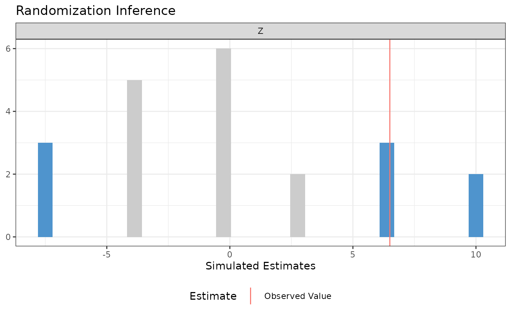
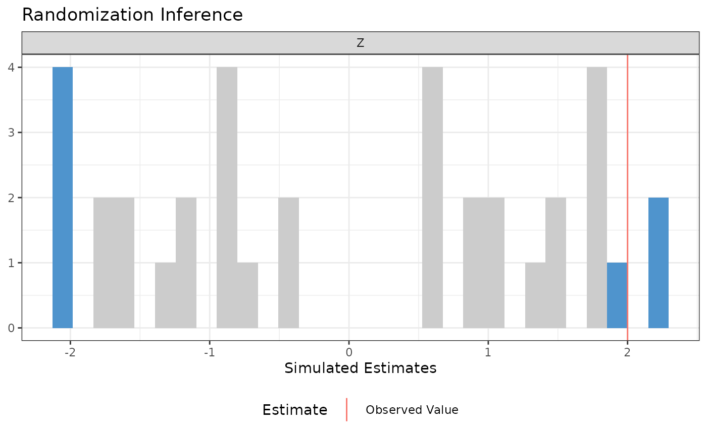
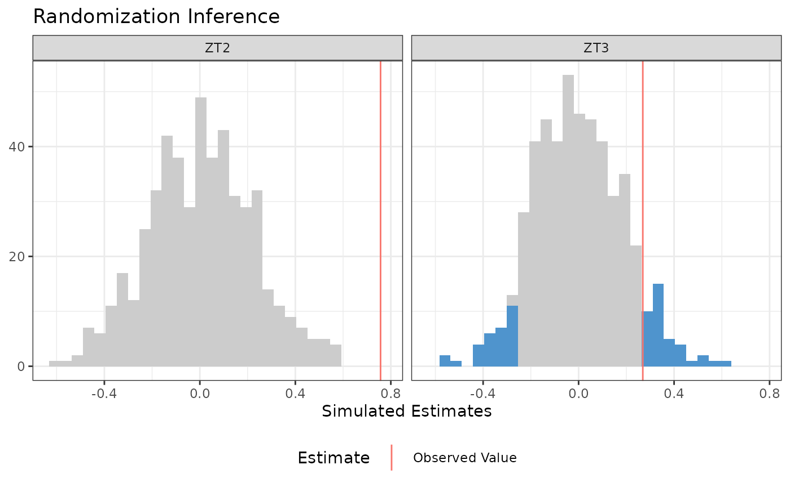
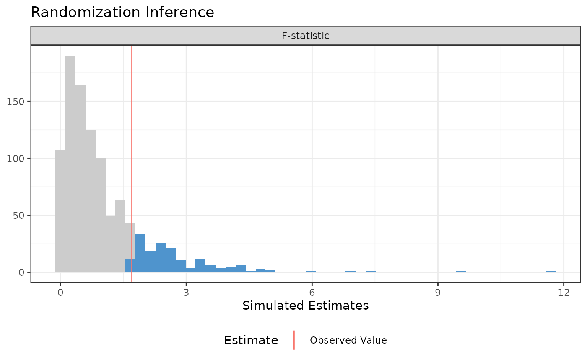
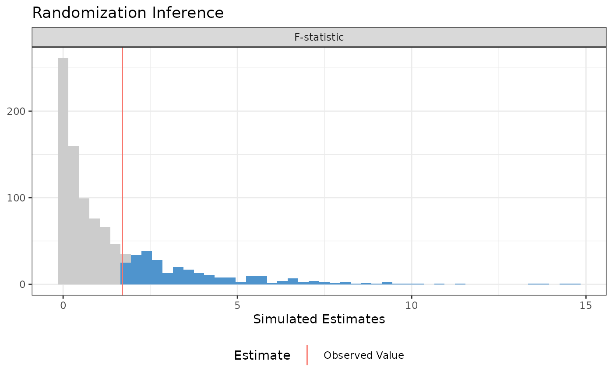
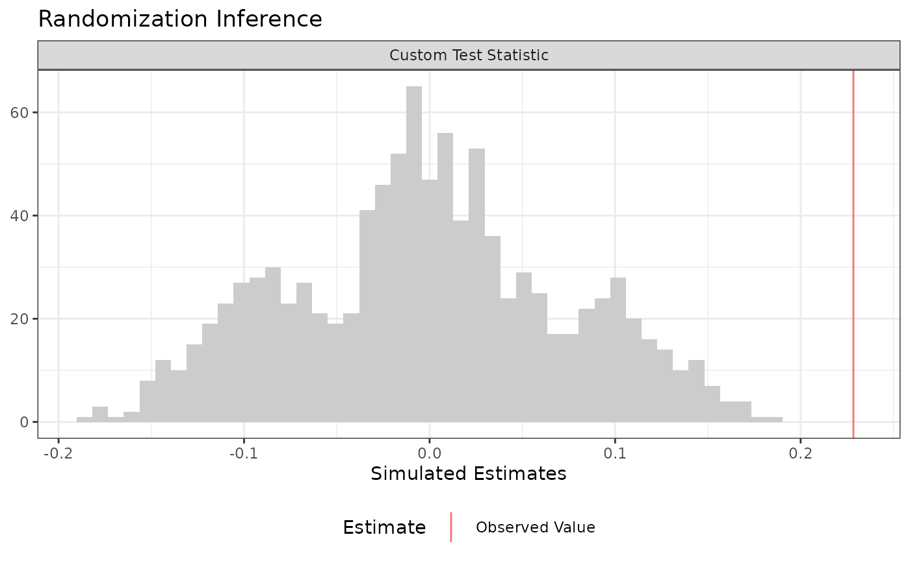
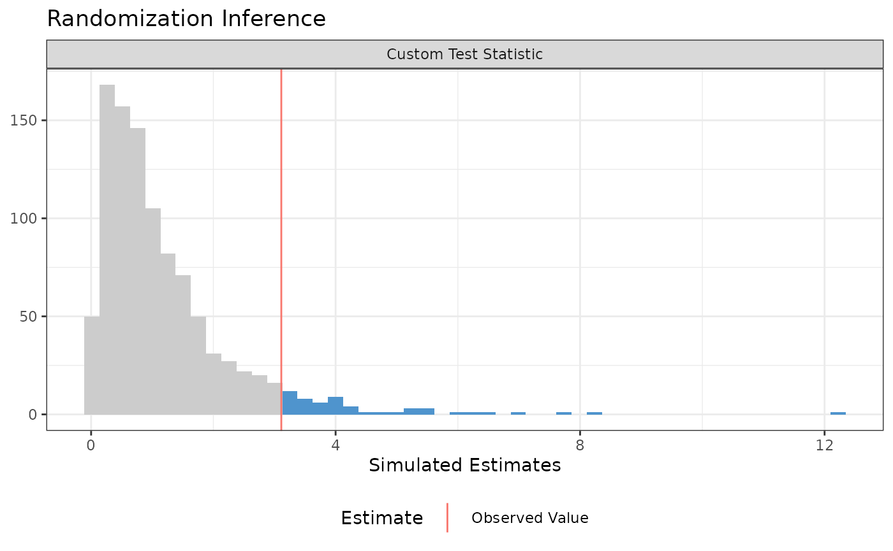

# Randomization Inference with ri2

``` r

library(ri2)
library(estimatr)
library(dplyr)
library(tidyr)
library(purrr)
library(forcats)
library(ggplot2)
```

Randomization inference (RI) is procedure for conducting hypothesis
tests in randomized experiments. RI is useful for calculating the the
probability that:

- a **test statistic** would be as extreme or more as observed…
- if a particular **null hypothesis** were true…
- over the all the possible randomizations that could have occurred
  acccording to the **design**.

That probability is sometimes called a $`p`$-value.

Randomization inference has a beautiful logic to it that may be more
appealing to you than traditional hypothesis frameworks that rely on
$`t`$- or $`F`$-tests. For a really lovely introduction to randomization
inference, read Chapter 3 of Gerber and Green (2012).

The hard part of actually conducting randomization inference is the
accounting. We need to enumerate all (or a random subset of all) the
possible randomizations, correctly implement the null hypothesis, maybe
figure out the inverse probability weights, then calculate the test
statistics over and over. You can do this by hand with loops. The `ri2`
package for r was written so that you don’t have to.[^1]

## Basic syntax

Gerber and Green (2012) describe a hypothetical experiment in which 2 of
7 villages are assigned a female council head and the outcome is the
share of the local budget allocated to water sanitation. Their table 2.2
describes one way the experiment could have come out.

``` r

table_2_2 <- tibble(Z = c(1, 0, 0, 0, 0, 0, 1),
                    Y = c(15, 15, 20, 20, 10, 15, 30))
```

In order to conduct randomization inference, we need to supply 1) a test
statistic, 2) a null hypothesis, and 3) a randomization procedure.

1.  The test statistic. The `formula` argument of the `conduct_ri`
    function is similar to the regression syntax of r’s built-in `lm`
    function. Our test statistic is the coefficient on `Z` from a
    regression of `Y` on `Z`, or more simply, the difference-in-means.
2.  The null hypothesis. The `sharp_hypothesis` argument of the
    `conduct_ri` function indicates that we are imagining a
    (hypothetical!) world in which the true difference in potential
    outcomes is exactly `0` for all units.
3.  The randomization procedure: The `declare_ra` function from the
    `randomizr` package allows us to declare a randomization procedure.
    In this case, we are assigning `2` units to treatment out of `7`
    total units.

``` r

# Declare randomization procedure
declaration <- declare_ra(N = 7, m = 2)

# Conduct Randomization Inference
ri2_out <- conduct_ri(
  formula = Y ~ Z,
  declaration = declaration,
  sharp_hypothesis = 0,
  data = table_2_2
)

summary(ri2_out)
```

    ##   term estimate two_tailed_p_value
    ## 1    Z      6.5          0.3809524

``` r

plot(ri2_out)
```



## More complex designs

The `ri2` package has specific support for all the randomization
procedures that can be described by the `randomizr` package:

1.  Simple
2.  Complete
3.  Blocked
4.  Clustered
5.  Blocked and clustered

See the [randomizr
vignette](https://declaredesign.org/r/randomizr/articles/randomizr_vignette.html)
for specifics on each of these procedures.

By way of illustration, let’s take the blocked-and-clustered design from
the `ri` package help files as an example. The call to `conduct_ri` is
the same as it was before, but we need to change the random assignment
declaration to accomodate the fact that clusters of two units are
assigned to treatment and control (within three separate blocks). Note
that in this design, the probabilities of assignment to treatment are
**not** constant across units, but the `conduct_ri` function by default
incorporates inverse probability weights to account for this design
feature.

``` r

dat <- tibble(
  Y = c(8, 6, 2, 0, 3, 1, 1, 1, 2, 2, 0, 1, 0, 2, 2, 4, 1, 1),
  Z = c(1, 1, 0, 0, 1, 1, 0, 0, 1, 1, 1, 1, 0, 0, 1, 1, 0, 0),
  cluster = c(1, 1, 2, 2, 3, 3, 4, 4, 5, 5, 6, 6, 7, 7, 8, 8, 9, 9),
  block = c(rep(1, 4), rep(2, 6), rep(3, 8))
)

# clusters in blocks 1 and 3 have a 1/2 probability of treatment
# but clusters in block 2 have a 2/3 probability of treatment
with(dat, table(block, Z))
```

    ##      Z
    ## block 0 1
    ##     1 2 2
    ##     2 2 4
    ##     3 4 4

``` r

block_m <-
  dat |>
  summarize(m = sum(Z) / 2, .by = block) |>
  arrange(block) |>
  pull(m)

declaration <- 
  with(dat,{
    declare_ra(
      blocks = block,
      clusters = cluster,
      block_m = block_m)
  })

declaration
```

    ## Random assignment procedure: Blocked and clustered random assignment 
    ## Number of units: 18 
    ## Number of blocks: 3
    ## Number of clusters: 9
    ## Number of treatment arms: 2 
    ## The possible treatment categories are 0 and 1.
    ## The number of possible random assignments is 36.  
    ## The probabilities of assignment are NOT constant across units. Your analysis strategy must account for differential probabilities of assignment, typically by employing inverse probability weights.

``` r

ri2_out <- conduct_ri(
  Y ~ Z,
  sharp_hypothesis = 0,
  declaration = declaration,
  data = dat
)
summary(ri2_out)
```

    ##   term estimate two_tailed_p_value
    ## 1    Z        2          0.1944444

``` r

plot(ri2_out)
```



## Multi-arm trials

The formula interface handles multi-arm trials directly. When the
treatment variable takes more than two values, `conduct_ri` produces one
result per pairwise comparison against the baseline condition (the first
condition in sorted order). The null distribution for each comparison is
constructed by re-randomizing only the units assigned to those two
conditions while leaving the remaining arms at their observed values.
Each arm therefore gets its own permutation draws, reflecting the
conditional design.

In the example below, units are assigned to one of three arms: `T1`
(control), `T2`, and `T3`. The call to `conduct_ri` looks the same as in
the two-arm case.

``` r

set.seed(42)
N <- 120
declaration <- declare_ra(N = N, num_arms = 3)

dat_3arm <-
  tibble(Z = conduct_ra(declaration)) |>
  mutate(Y = 0.6 * (Z == "T2") + 0.0 * (Z == "T3") + rnorm(n()))

ri2_out <- conduct_ri(
  formula          = Y ~ Z,
  declaration      = declaration,
  sharp_hypothesis = 0,
  data             = dat_3arm,
  sims             = 500
)

summary(ri2_out)
```

    ##   term  estimate two_tailed_p_value
    ## 1  ZT2 0.7569473               0.00
    ## 2  ZT3 0.2689631               0.14

``` r

plot(ri2_out)
```



The summary and plot return one row (or panel) per comparison. Here `T2`
has a detectable effect while `T3` does not.

When the arms have different hypothesized effects, `sharp_hypothesis`
accepts a vector of length $`k - 1`$, one entry per comparison in the
same order as the terms in the output:

``` r

# Test T2 against H0: tau = 0.6, T3 against H0: tau = 0
ri2_out_vec <- conduct_ri(
  formula          = Y ~ Z,
  declaration      = declaration,
  sharp_hypothesis = c(0.6, 0.0),
  data             = dat_3arm,
  sims             = 500
)

summary(ri2_out_vec)
```

    ##   term  estimate two_tailed_p_value
    ## 1  ZT2 0.7569473              0.350
    ## 2  ZT3 0.2689631              0.558

### Why conditioning on the two-arm comparison matters

The pairwise null distribution for T2 vs T1 is constructed by
re-randomizing only the T1 and T2 units. A natural but wrong alternative
is to permute all three arms and then extract the T2-vs-T1 difference
from each permutation. The problem: T3-assigned units carry their T3
potential outcomes. When a full permutation shuffles them into T1 or T2,
their outcomes pollute the null distribution, since those outcomes
reflect the T3 effect rather than anything about T2 vs T1.

The contamination is most visible when T3 has a large effect. Here T3
has an effect of 3, while T2 has an effect of 0.4:

The two approaches differ only in how they build a simulated assignment.
The naive one draws a fresh assignment for all three arms. The correct
one shuffles the labels of the two arms being compared among the units
that actually received them, leaving every other unit at its observed
arm. `permute_within` does the shuffling:

``` r

permute_within <- function(z, arms) {
  shuffled <- z %in% arms
  z[shuffled] <- sample(z[shuffled])
  z
}
```

Rather than simulate one assignment at a time, we stack every simulation
into one long data frame: `sims` copies of the experiment, each with its
own simulated assignment, then a single grouped summary at the end.
`arm_dims` takes such a frame and returns the simulated
difference-in-means for one arm against the T1 baseline:

``` r

arm_dims <- function(draws, arm) {
  draws |>
    filter(Z_sim %in% c("T1", arm)) |>
    summarize(mean_Y = mean(Y), .by = c(approach, sim, Z_sim)) |>
    pivot_wider(names_from = Z_sim, values_from = mean_Y) |>
    mutate(est_sim = .data[[arm]] - T1)
}
```

``` r

set.seed(7)
declaration_contam <- declare_ra(N = 90, num_arms = 3)

dat_contam <-
  tibble(Z = conduct_ra(declaration_contam)) |>
  mutate(Y = 0.4 * (Z == "T2") + 3.0 * (Z == "T3") + rnorm(n()))

obs_dim <-
  dat_contam |>
  mutate(approach = "observed", sim = 1, Z_sim = Z) |>
  arm_dims("T2") |>
  pull(est_sim)

null_dims <-
  bind_rows(
    "Naive: full permutation" =
      expand_grid(sim = 1:1000, dat_contam) |>
      mutate(Z_sim = conduct_ra(declaration_contam), .by = sim),
    "Correct: conditional permutation" =
      expand_grid(sim = 1:1000, dat_contam) |>
      mutate(Z_sim = permute_within(Z, c("T1", "T2")), .by = sim),
    .id = "approach"
  ) |>
  arm_dims("T2")
```

The naive null distribution is much wider because units with
$`Y \approx 3`$ (the T3 units) randomly land in T1 or T2 across
permutations, adding variance that has nothing to do with the T2 vs T1
comparison:

``` r

gg_df <-
  null_dims |>
  mutate(approach = fct_relevel(approach, "Naive: full permutation"))

ggplot(gg_df, aes(x = est_sim)) +
  geom_histogram(bins = 40, fill = "grey80", colour = "white") +
  geom_vline(xintercept = obs_dim, colour = "steelblue", linewidth = 1) +
  facet_wrap(~ approach) +
  labs(x = "Simulated T2 vs T1 difference-in-means", y = NULL) +
  theme_bw() +
  theme(legend.position = "none")
```


``` r

null_dims |>
  summarize(sd_null = sd(est_sim),
            p_value = mean(abs(est_sim) >= abs(obs_dim)),
            .by = approach)
```

    ## # A tibble: 2 × 3
    ##   approach                         sd_null p_value
    ##   <chr>                              <dbl>   <dbl>
    ## 1 Naive: full permutation            0.455   0.235
    ## 2 Correct: conditional permutation   0.244   0.022

The naive null’s inflated variance swamps the T2 signal: its p-value is
too large. The correct null’s narrower spread gives a p-value that
reflects the actual T2 effect.
[`conduct_ri()`](https://alexandercoppock.com/ri2/reference/conduct_ri.md)
always uses the conditional approach.

The direction of the distortion, however, is not fixed. It depends on
whether T3 units add or remove variance when mixed into the T2/T1
comparison. The previous example had high-variance T3 units, which
widened the naive null and made it conservative. A different but equally
plausible design produces the opposite: a **leveling treatment**, where
T3 brings all units to a similar outcome level, eliminating baseline
heterogeneity. T3 units then have very low outcome variance. When a full
permutation shuffles them into the T2 or T1 group, they *anchor* the
group means, narrowing the naive null distribution for the T2
comparison. The same effect that made naive conservative before now
makes it anti-conservative.

At the same time, high-variance T1/T2 units contaminate the T3
comparison when they shuffle in, widening that null and reducing power
precisely where we have a real effect to detect.

The same two helpers do the work here. One replication draws an
experiment, builds both null distributions for both comparisons, and
returns four p-values:

``` r

one_replication <- function(declaration, sims = 300) {
  dat_lev <-
    tibble(Z = conduct_ra(declaration)) |>
    mutate(Y = if_else(Z == "T3",
                       rnorm(n(), mean = 1.5, sd = 0.1),
                       rnorm(n(), mean = 0, sd = 6)))

  draws <- function(arm) {
    bind_rows(
      naive =
        expand_grid(sim = 1:sims, dat_lev) |>
        mutate(Z_sim = conduct_ra(declaration), .by = sim),
      correct =
        expand_grid(sim = 1:sims, dat_lev) |>
        mutate(Z_sim = permute_within(Z, c("T1", arm)), .by = sim),
      .id = "approach"
    ) |>
      arm_dims(arm) |>
      mutate(arm = arm)
  }

  observed <-
    map(c("T2", "T3"), \(arm)
        dat_lev |>
          mutate(approach = "observed", sim = 1, Z_sim = Z) |>
          arm_dims(arm) |>
          mutate(arm = arm)) |>
    list_rbind() |>
    select(arm, est_obs = est_sim)

  map(c("T2", "T3"), draws) |>
    list_rbind() |>
    left_join(observed, by = "arm") |>
    summarize(p_value = mean(abs(est_sim) >= abs(est_obs)), .by = c(arm, approach))
}
```

Running it 300 times gives the rejection rate of each approach. T2’s
sharp null is true, so its rejection rate should sit at 0.05. T3 has a
real effect, so a higher rate there is power:

``` r

set.seed(42)
declaration_lev <- declare_ra(N = 90, num_arms = 3)

leveling_results <-
  tibble(replication = 1:300) |>
  mutate(p_values = map(replication, \(r) one_replication(declaration_lev))) |>
  unnest(p_values) |>
  summarize(rejection_rate = mean(p_value < 0.05), .by = c(arm, approach))

leveling_results
```

    ## # A tibble: 4 × 3
    ##   arm   approach rejection_rate
    ##   <chr> <chr>             <dbl>
    ## 1 T2    naive            0.0967
    ## 2 T2    correct          0.0533
    ## 3 T3    naive            0.17  
    ## 4 T3    correct          0.253

The naive T2 test rejects at roughly twice the nominal rate: the
low-variance T3 units narrow its null distribution, making modest
observed T2 differences look extreme. The naive T3 test has
substantially lower power: high-variance T1/T2 units inflate its null
distribution, making the real T3 effect harder to detect. The correct
conditional approach maintains the nominal type I error rate for T2 and
the correct power for T3 in both scenarios. The conditional permutation
is not a technicality: it is what makes the test valid.

## Comparing nested models

A traditional ANOVA hypothesis testing framework (implicitly or
explicitly) compares two models, a restricted model and an unrestricted
model, where the restricted model can be said to “nest” within the
unrestricted model. The difference between models is summarized as an
$`F`$-statistic. We then compare the observed $`F`$-statistic to a
hypothetical null distribution that, under some possibly wrong
assumptions can be said to follow an $`F`$-distribution.

In a randomization inference framework, we’re happy to use the
$`F`$-statistic, but we want to construct a null distribution that
corresponds to the distribution of $`F`$-statistics that we would obtain
if a particular (typically sharp) null hypothesis were true and we
cycled through all the possible random assignments.

To do this in the `ri2` package, we need to supply model formulae to the
`model_1` and `model_2` arguments of `conduct_ri`.

### Three Arm Trial

In this example, we consider a three-arm trial. We want to conduct the
randomization inference analogue of an $`F`$-test to see if any of the
treatments influenced the outcome. We’ll consider the sharp null
hypothesis that each unit would express exactly the same outcome
regardless of which of the three arms it was assigned to.

``` r

N <- 100
# three-arm trial, treat 33, 33, 34 or 33, 34, 33, or 34, 33, 33
declaration <- declare_ra(N = N, num_arms = 3)

dat <-
  tibble(Z = conduct_ra(declaration)) |>
  mutate(Y = .9 * .2 * (Z == "T2") + -.1 * (Z == "T3") + rnorm(n()))

ri2_out <-
  conduct_ri(
    model_1 = Y ~ 1, # restricted model
    model_2 = Y ~ Z, # unrestricted model
    declaration = declaration,
    sharp_hypothesis = 0,
    data = dat
  )

plot(ri2_out)
```



``` r

summary(ri2_out)
```

    ##          term estimate two_tailed_p_value
    ## 1 F-statistic 1.703975              0.171

``` r

# for comparison
anova(lm(Y ~ 1, data = dat), 
      lm(Y ~ Z, data = dat))
```

    ## Analysis of Variance Table
    ## 
    ## Model 1: Y ~ 1
    ## Model 2: Y ~ Z
    ##   Res.Df    RSS Df Sum of Sq     F Pr(>F)
    ## 1     99 110.31                          
    ## 2     97 106.57  2    3.7441 1.704 0.1874

### Interaction terms

Oftentimes in an experiment, we’re interested the difference in average
treatment effects by subgroups defined by pre-treatment characteristics.
For example, we might want to know if the average treatment effect is
larger for men or women. If we want to conduct a formal hypothesis test,
we’re not interested in testing against the sharp null of no effect for
any unit – we want to test against the null hypothesis of **constant
effects**. In the example below, we test using the null hypothesis that
all units have a constant effect equal to the estimated ATE. See Gerber
and Green (2012) Chapter 9 for more information on this procedure.

``` r

N <- 100
# two-arm trial, treat 50 of 100
declaration <- declare_ra(N = N)
dat <-
  tibble(X = rnorm(N), Z = conduct_ra(declaration)) |>
  mutate(Y = .9 + .2 * Z + .1 * X + -.5 * Z * X + rnorm(n()))

# Observed ATE
ate_hat <-
  lm_robust(Y ~ Z, data = dat) |>
  tidy() |>
  filter(term == "Z") |>
  pull(estimate)

ate_hat
```

    ## [1] 0.2486798

``` r

ri2_out <-
  conduct_ri(
    model_1 = Y ~ Z + X, # restricted model
    model_2 = Y ~ Z + X + Z*X, # unrestricted model
    declaration = declaration,
    sharp_hypothesis = ate_hat,
    data = dat
  )

plot(ri2_out)
```



``` r

summary(ri2_out)
```

    ##          term estimate two_tailed_p_value
    ## 1 F-statistic 1.701251              0.282

``` r

# for comparison
anova(lm(Y ~ Z + X, data = dat),
      lm(Y ~ Z + X + Z*X, data = dat))
```

    ## Analysis of Variance Table
    ## 
    ## Model 1: Y ~ Z + X
    ## Model 2: Y ~ Z + X + Z * X
    ##   Res.Df    RSS Df Sum of Sq      F Pr(>F)
    ## 1     97 102.37                           
    ## 2     96 100.59  1    1.7825 1.7013 0.1952

## Arbitrary test statistics

A major benefit of randomization inference is we can specify any scalar
test statistic, which means we can conduct hypothesis tests for
estimators beyond the narrow set for which statisticians have derived
the variance. The `ri2` package accommodates this with the
`test_function` argument of `conduct_ri`. You supply a function that
takes a `data.frame` as its only argument and returns a scalar;
`conduct_ri` does the rest!

### Difference-in-variances

For example, we can conduct a difference-in-variances test against the
sharp null of no effect for any unit:

``` r

N <- 100
declaration <- declare_ra(N = N, m = 50)

dat <-
  tibble(Z = conduct_ra(declaration)) |>
  mutate(Y = .9 + rnorm(n(), sd = .25 + .25 * Z))

# arbitrary function of data
test_fun <- function(data) {
  data |>
    summarize(var_Y = var(Y), .by = Z) |>
    pivot_wider(names_from = Z, values_from = var_Y, names_prefix = "Z") |>
    mutate(diff_var = Z1 - Z0) |>
    pull(diff_var)
}

# confirm it works
test_fun(dat)
```

    ## [1] 0.2284293

``` r

ri2_out <-
conduct_ri(
  test_function = test_fun,
  declaration = declaration,
  assignment = "Z",
  outcome = "Y",
  sharp_hypothesis = 0,
  data = dat
)

plot(ri2_out)
```



``` r

summary(ri2_out)
```

    ##                    term  estimate two_tailed_p_value
    ## 1 Custom Test Statistic 0.2284293                  0

### Balance Test

Researchers sometimes conduct balance tests as a randomization check.
Rather than conducting separate tests covariate-by-covariate, we might
be interested in conducting an omnibus test.

Imagine we’ve got three covariates `X1`, `X2`, and `X3`. We’ll get a
summary balance stat (the $`F`$-statistic in this case), but it really
could be anything!

``` r

N <- 100
declaration <- declare_ra(N = N)

dat <-
  tibble(
    X1 = rnorm(N),
    X2 = rbinom(N, 1, .5),
    X3 = rpois(N, 3),
    Z = conduct_ra(declaration)
  )

balance_fun <- function(data) {
  lm_robust(Z ~ X1 + X2 + X3, data = data)$fstatistic[["value"]]
}

# Confirm it works!
balance_fun(dat)
```

    ## [1] 3.11156

``` r

ri2_out <-
  conduct_ri(
  test_function = balance_fun,
  declaration = declaration,
  assignment = "Z",
  sharp_hypothesis = 0,
  data = dat
  )

plot(ri2_out)
```



``` r

summary(ri2_out)
```

    ##                    term estimate two_tailed_p_value
    ## 1 Custom Test Statistic  3.11156              0.055

``` r

# For comparison
lm_robust(Z ~ X1 + X2 + X3, data = dat)
```

    ##                 Estimate Std. Error     t value     Pr(>|t|)    CI Lower
    ## (Intercept)  0.626507883 0.11688584  5.35999832 5.717938e-07  0.39449133
    ## X1           0.060203097 0.04787220  1.25757958 2.115944e-01 -0.03482246
    ## X2          -0.265953770 0.09767134 -2.72294595 7.686149e-03 -0.45982984
    ## X3           0.001054774 0.02998723  0.03517413 9.720139e-01 -0.05846940
    ##                CI Upper DF
    ## (Intercept)  0.85852443 96
    ## X1           0.15522866 96
    ## X2          -0.07207770 96
    ## X3           0.06057895 96

## Conclusion

All of the randomization inference procedures had to, somehow or other,
provide three pieces of information:

1.  a test statistic (the difference-in-means, a regression coefficient,
    the difference-in-variances, an $`F`$-statistic, etc.)
2.  a sharp null hypothesis. The “sharp” in this context means that the
    null hypothesis has something specific to say about every unit’s
    potential outcomes. For example, the sharp null hypothesis of no
    effect for any unit means hypothesizes that each unit’s treatment
    and control potential outcome are identical.
3.  A randomization procedure. We discussed simple, complete, blocked,
    clustered, and blocked and clustered designs, but these are not an
    exhaustive list of every kind of random assignment. Whatever your
    randomization procedure is, you have respect it!

Randomization inference is a useful tool because we can conduct
hypothesis tests without making additional assumptions about the
distributions of outcomes or estimators. We can also do tests for
arbitrary test statistics – we’re not just restricted to the set for
which statisticians have worked out analytic hypothesis testing
procedures.

A downside is that RI can be a pain to set up – the `ri2` package is
designed to make this part easier.

[^1]: The `ri2` package is the successor to the `ri` package, written by
    Peter Aronow and Cyrus Samii. `ri` was lightweight, fast, and
    correct for the set of tasks it handled. `ri2` hopes to be all that
    and more.
